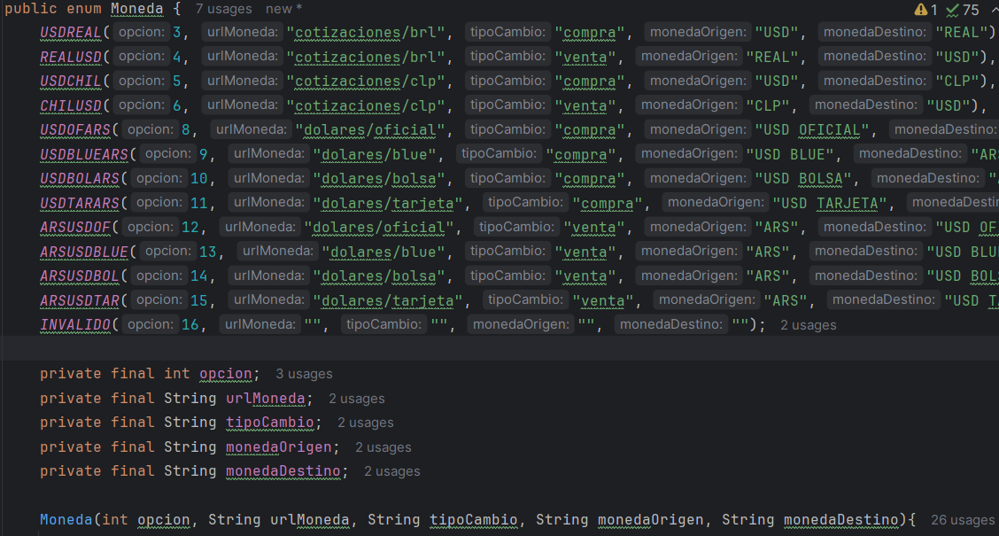
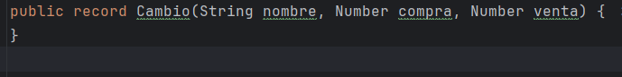
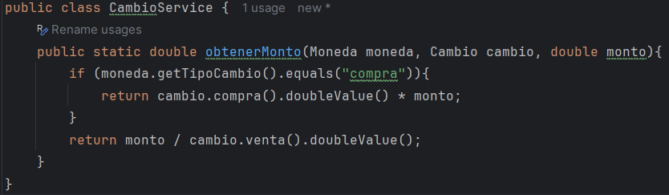
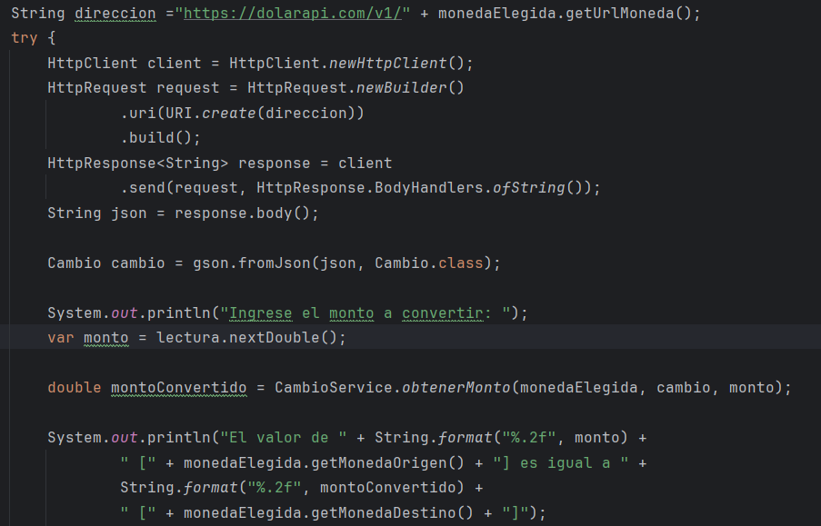
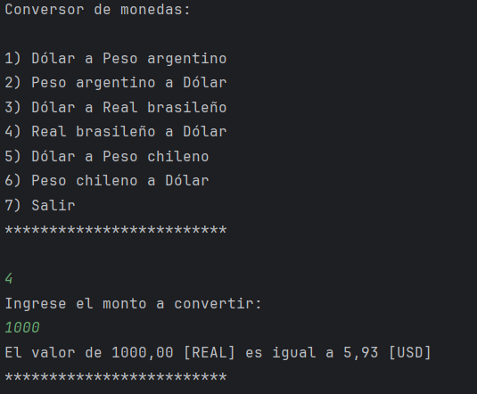
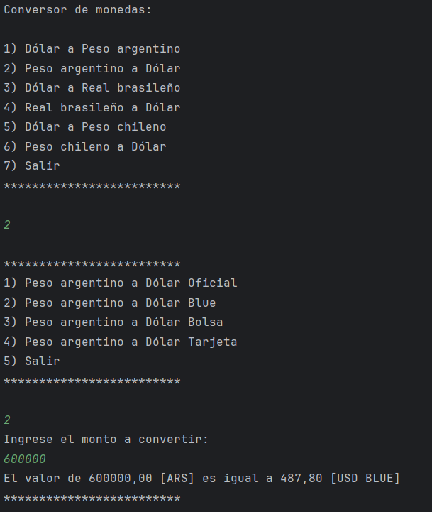

# Conversor de monedas con dolarapi.com

Este proyecto es una aplicación en Java que permite realizar conversiones entre diferentes monedas. El programa permite al usuario seleccionar entre varias opciones de monedas (por ejemplo, USD a BRL, USD a CLP, etc.), ingresar un monto en la moneda de origen y obtener la cantidad equivalente en la moneda de destino.
Se incluye el tipo de cambio de USD oficial, blue, bolsa y tarjeta para Peso Argentino.

## Características

- Selección de monedas de origen y destino.
- Realización de la conversión según las tasas de cambio obtenidas de dolarapi.com.
- Interfaz interactiva para que el usuario ingrese montos y seleccione opciones.
- Visualización de la tasa de cambio actual y resultados de conversión.

## Tecnologías Utilizadas

- **Java**: Lenguaje de programación principal.
- **Gson**: Biblioteca para manejar conversiones de JSON.
- **API externa**: Consulta de tasas de cambio mediante un JSON proveído por dolarapi.com.

## Explicación del código

Este `enum` agrupa las opciones de conversión de divisas. Cada opción tiene un número asociado el cual será la opción elegida por el usuario, una URL de cotización, y una clave que define si la operación es de compra o venta.

Cuando se recibe el JSON, se deserializa a una instancia de `Cambio`. Este objeto puede luego ser utilizado para acceder a los datos de cotización de manera estructurada, como en `cambio.compra` o `cambio.nombre`, sin necesidad de manipular los datos crudos o no estructurados que se reciben desde la API.

La clase `CambioService` proporciona un método para obtener la tasa de cambio y calcular la conversión de una moneda a otra según la cotización actual. Esta clase utiliza la información de la moneda y la cotización obtenida a través del `record` llamado `Cambio`, el cual contiene las tasas de compra y venta.

En este código se muestra lo principal del programa. A través de la moneda elegida se completa la dirección URL, se crea el cliente, el pedido y la respuesta, la cual su cuerpo viene en formato JSON. Como se explicó anteriormente, se deserializa a una instancia de `Cambio` y cuando el usuario ingresa el monto a convertir, se obtiene el monto convertido y se muestra en pantalla.

## Ejemplo de uso

1. Elige la opción para convertir BRL a USD.
2. Ingresa el monto en BRL.
3. Obtén el resultado de la conversión a USD según la tasa de venta.

1. Elige la opción para convertir ARS a USD.
2. Elige la opción del tipo de dólar, por ejemplo Blue.
3. Ingresa el monto en ARS.
4. Obtén el resultado de la conversión a USD según la tasa de venta.

Nota: Cuando se pasa de Dólar a otra moneda, se utiliza la tasa de compra.
